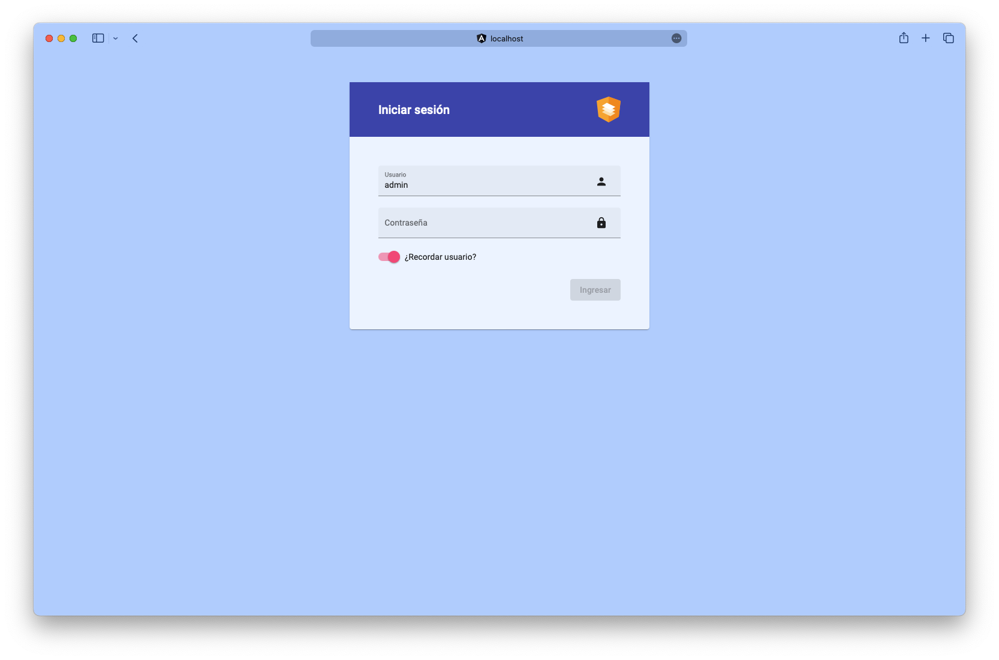

# 👾 Awesome App

It is an awesome application that allows you to do a lot of things.

## 👨‍💻 Authors

- [@MtzAlfonso](https://github.com/MtzAlfonso)

## 🛠 Tech Stack

- Angular 13.x.x
- Angular CLI 13.x.x
- Angular Material 13.x.x
- Bootstrap 4.x.x

## 🚀 Run Locally

Clone the project in your local machine

```bash
  git clone https://github.com/MtzAlfonso/awesome-app.git
```

If you don't have the Angular CLI installed, you can install it with the following command:

```bash
  npm install -g @angular/cli@13
```

Go to the project directory

```bash
  cd awesome-app
```

Install dependencies

```bash
  npm install
```

Start the server

```bash
  npm run start
```

## 📝 Features

### Login page

The user can enter their username and password and see a message if the login was successful or not.

Once the user logs in, the app will generate a token and store it in the local storage. The token is used to simulate the login service.

> [!WARNING]
> Login service is not available. The login is simulated and no data is sent to a server.

> [!IMPORTANT]
> To log in, use the following credentials:
>
> - Username: `admin`
> - Password: `admin`

### Authentication

The app has a guard that checks if the user is logged in.

If the user is not logged in, the app will redirect to the login page.

If the user is logged in, the app will allow the user to navigate to the different pages.

### Welcome page

This is a welcome page where the user can enter their name and see a message with the name. The message is transformed with a custom pipe.

### Sidebar

It is a sidebar component that allows the user to navigate to the different pages of the app.

### Conversion page

This is an empty page. The user can see a message with the page name.

### Calculate date page

The user can select a date, a unit (days, months, years) and a number. The app will calculate the new date and show it to the user.

### Reactive form page

The user can fill a form and validate it with Angular's reactive forms and custom validators.

> [!WARNING]
> The **civil status** catalog is not available. The options are simulated.

## 🖼️ Screenshots

### Login page




### Welcome page


### Sidebar


### Conversion page


### Calculate date page


### Reactive form page


### Logout modal


## 🧪 Testing

Run the unit tests via [Karma](https://karma-runner.github.io).

```bash
  npm run test
```

Or you can run the following command:

```bash
  ng test
```

## 🔧 Support

For support or any questions, you can contact me at mtz.alfonso96@gmail.com
